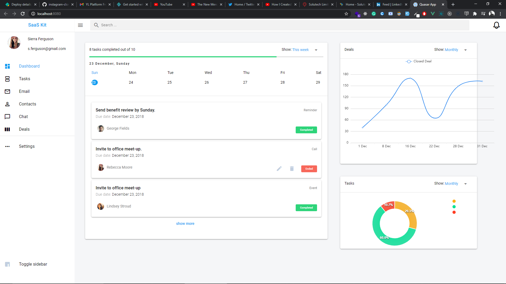
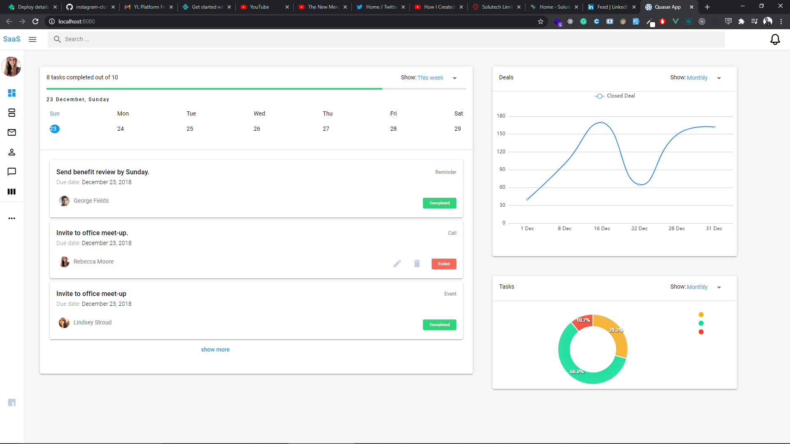
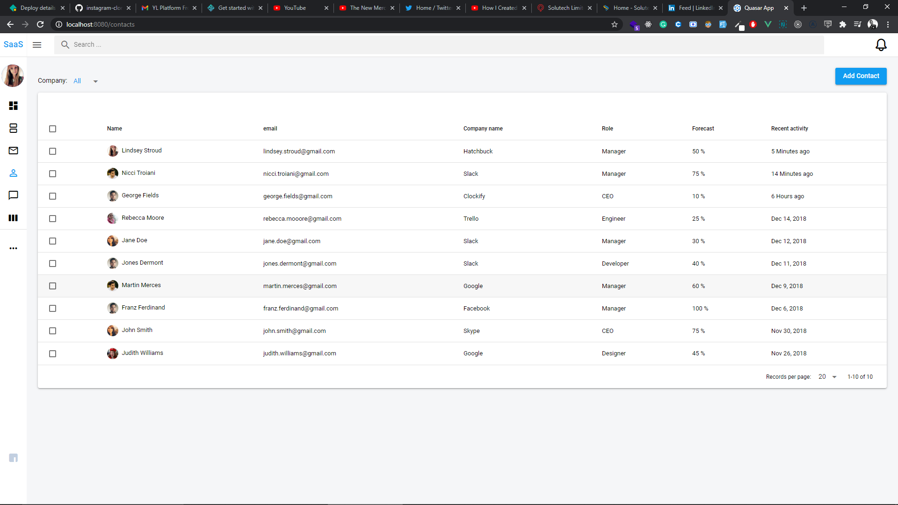
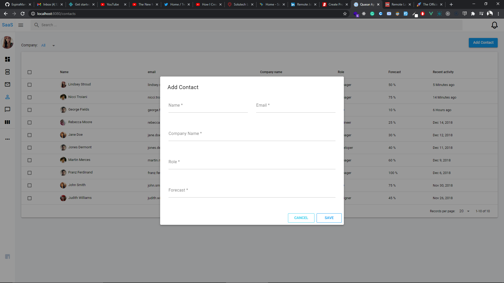
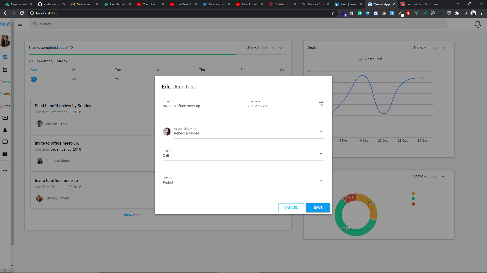
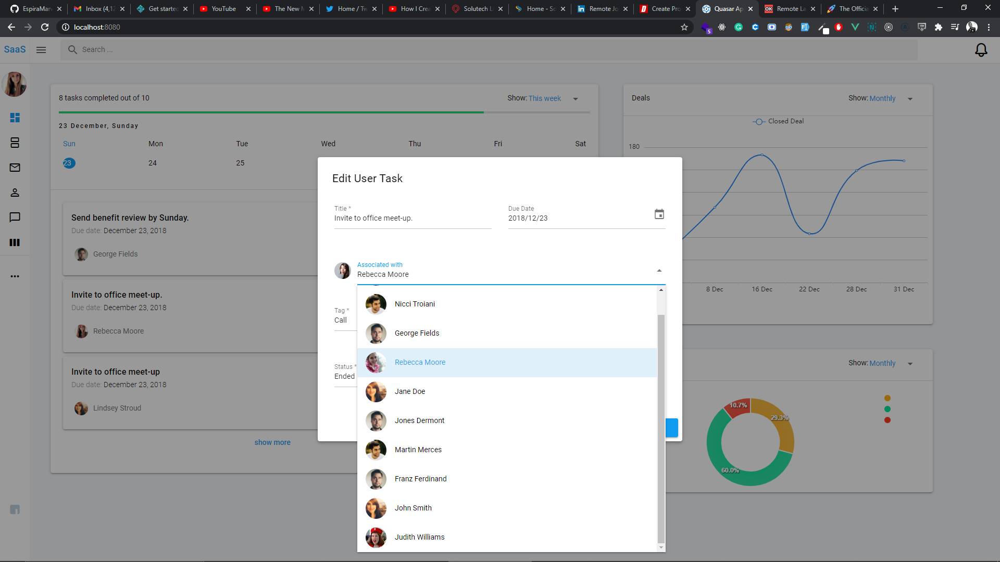
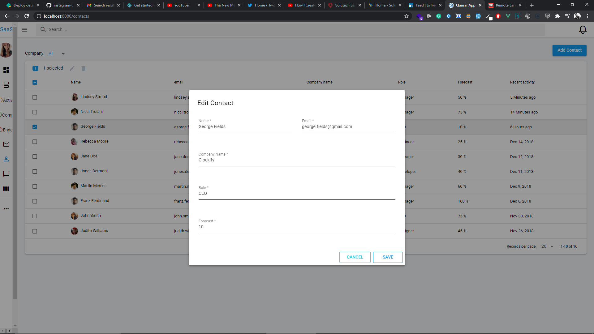
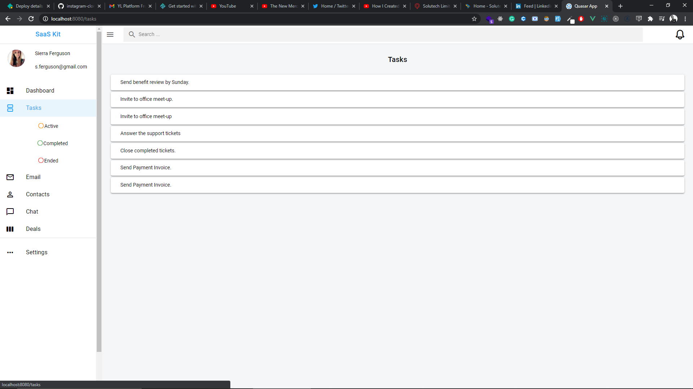
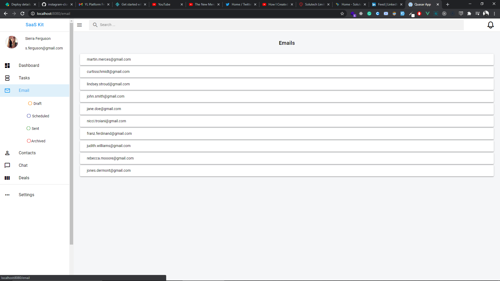
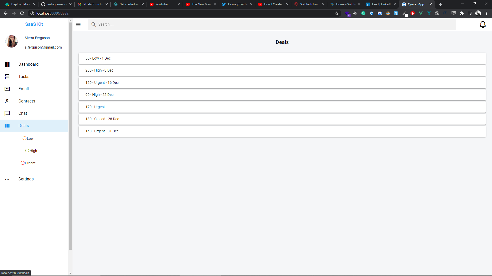

## quasar-test
To Install the app follow these instructions

### clone this [repo](https://github.com/EspiraMarvin/quasar-test.git)

### navigate to the folder containing this cloned repo

### open the folder with your editor of choice

### Install the dependencies run

```bash
yarn install
```

### Start the app in development

```bash
quasar dev / yarn dev
```

### It's served on port `8089`

### Visit [localhost:8089](http://localhost:8089)

### To run all tests
```bash
quasar test --unit jest / yarn run unit
```

### note: data is served from src folder under Config/data.js
### Link to the site is also [here](https://quasar-admin-site.netlify.app)

<div>
Dashboard Toggled

Dashboard

Contacts

Add Contact

Edit User Task

Edit User Task Select User Dropdown

Edit Contact

Tasks

Emails

Deals


</div>
